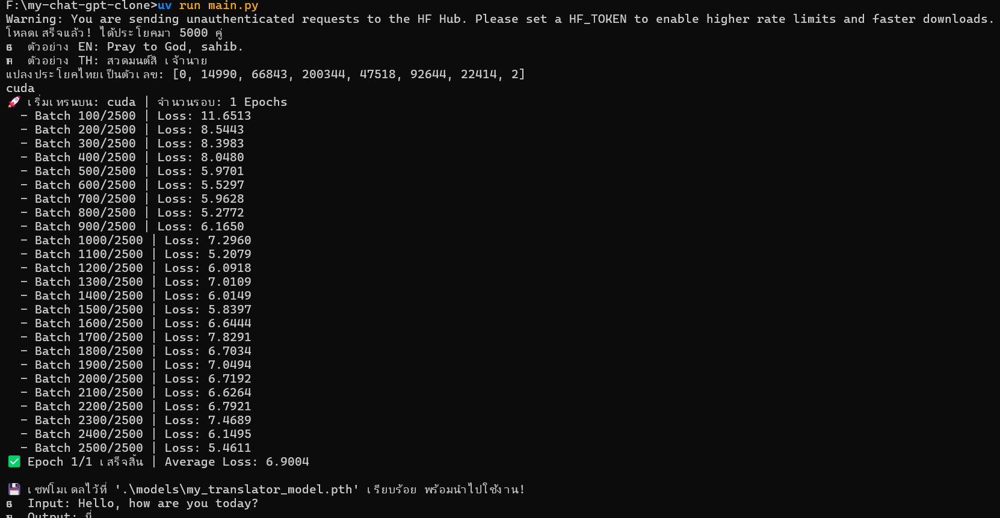

# Source Learning & AI helper
https://nlp.seas.harvard.edu/annotated-transformer/
# ทดสอบ การแปลภาษา
```bash
1. Tokenization (จุดรับวัตถุดิบ)ทำอะไร: 
หั่นประโยคข้อความให้เป็นชิ้นเล็กๆ (คำ/พยางค์) แล้วแปลงเป็น "ตัวเลข (Token ID)"แปลงทำไม: คอมพิวเตอร์ไม่รู้จักตัวอักษร มันคำนวณได้เฉพาะตัวเลขเท่านั้นInput -> Output: "Hello" -> [7592]
```

```bash
2. Embedding & Positional Encoding (แผนกสร้างความหมาย)ทำอะไร: เอาตัวเลข ID ไปเปิดดิกชันนารีเพื่อแปลงเป็น "เวกเตอร์ (Array ของตัวเลขหลายมิติ)" เช่น 256 มิติ และบวกค่า "ตำแหน่ง" ของคำนั้นเข้าไปแปลงทำไม: เพื่อให้โมเดลรู้ว่าคำนี้มีความหมายในเชิงลึกว่าอะไร (เช่น หมา กับ แมว จะมีเวกเตอร์คล้ายกัน) และรู้ว่าคำนี้อยู่ตำแหน่งไหนในประโยคInput -> Output: [7592] -> [0.12, -0.55, 0.89, ... 256 ตัว]
```

```bash
3. Encoder / ฝั่ง BERT (แผนกอ่านและทำความเข้าใจ)ทำอะไร: ใช้ Multi-Head Self-Attention อ่านเวกเตอร์ทุกคำในประโยคพร้อมๆ กัน (มองซ้ายมองขวา) เพื่อดูว่าคำไหนขยายคำไหนแปลงทำไม: เพื่อสรุป "บริบท (Context)" ของประโยคต้นทางทั้งหมดให้กลายเป็นก้อนความรู้ที่สมบูรณ์ที่สุดInput ->$ Output: เวกเตอร์คำดิบๆ -> Context Vectors (เวกเตอร์ที่อัดแน่นไปด้วยความหมายของทั้งประโยค)
```

```bash
4. Decoder / ฝั่ง GPT (แผนกเขียนและแต่งประโยค)ทำอะไร: รับคำที่เพิ่งแต่งไปหมาดๆ เข้ามา แล้วหันไปมอง (Cross-Attention) ข้อมูล Context Vectors จากฝั่ง BERT เพื่อตัดสินใจว่าจะพิมพ์คำอะไรต่อไป โดยมีกฎเหล็กคือ "ห้ามแอบดูอนาคต" (Masking)แปลงทำไม: เพื่อค่อยๆ สร้างประโยคคำตอบออกมาให้สอดคล้องกับสิ่งที่ฝั่ง BERT อ่านมาInput -> Output: เวกเตอร์คำที่แต่งแล้ว + Context Vectors -> เวกเตอร์ของ "คำถัดไป"
```

```bash
5. Output Layer (จุดส่งมอบสินค้า)ทำอะไร: นำเวกเตอร์ของคำถัดไป ไปคูณกับตัวเลขเพื่อแปลงกลับให้มีขนาดเท่ากับ "จำนวนคำศัพท์ทั้งหมด (Vocab Size)" แล้วใช้ฟังก์ชัน Softmax เพื่อแปลงเป็น "เปอร์เซ็นต์ความน่าจะเป็น"แปลงทำไม: เพื่อให้โมเดลฟันธงว่า ในบรรดาคำศัพท์ 5,000 คำ คำไหนมีโอกาสถูกเลือกเป็นคำถัดไปมากที่สุดInput -> Output: เวกเตอร์คำถัดไป -> [0.01%, 0.05%, ..., 95.0% (คำว่า "สวัสดี"), ...]
```

# Result training & test
